# INT_CPL_inquiry_assessment_schema_0 - requirement02

## Requirement Notes

ไฟล์นี้เป็น version ที่เพิ่ม `note` เชิง script logic จากโค้ดใน `INT_CPL_inquiry_assessment_schema_0.xml` โดยตั้งใจให้ใช้เป็นตัวอย่างสำหรับงานถัดไปที่ต้องการ:

- มี sequence diagram แบบอิง `requirement01.md`
- มี note สรุป logic ของ script สำคัญ เช่น `mappingForm`, `MappingSchema`, `setAnswers`, `Output`
- มี note ประกบช่วง `activate` / `deactivate` เพื่อให้อ่าน timeline และ I/O ได้ง่ายขึ้น

## Source Files

- `INT_CPL_inquiry_assessment_schema_0.xml`
- `INT_CPL_inquiry_assessment_schema_0.xml.layout`
- `requirement02.md`

## Important Script Summary

- `isSavingCoopOrAgriCoop`
  ใช้ customer code และ assessment type เพื่อตัดสินใจว่าจะใช้ master answer/history flow หรือไม่
- `setLoanDBM`
  เลือก loan request ระหว่าง retail/corp โดยเทียบวงเงิน และถ้าไม่เจอข้อมูลเลยจะ set `isInCBS = true`
- `setLoanHeaderDBM`
  เลือก header ระหว่าง retail/corp ตามข้อมูลที่ query ได้
- `map_list_interest_rate_code`
  รวม market code interest หลาย key แล้ว append `LN0100`, `LN0200`, `LN0800` พร้อม dedupe
- `map_interest_rate`
  จับคู่ผล `fn_get_interest_rate` กับ `mas_index` แล้วสะสมเป็น `interestRateList`
- `mappingForm`
  กรณี multi-form จะ merge base form เข้ากับ non-base form เพื่อให้แต่ละ form มี section/topic/option ครบ
- `AddSection`
  แปลง definition ของ form/section/topic/summary เป็น UI schema component เช่น Radio, Input, Table, Select, SummaryInput
- `AddCalculate`
  ดึง formula จาก topic ที่มีสูตร ไปจัดเป็น calculate object
- `PointerCount`
  push schema ของ form ปัจจุบันเข้า `globalVariables.schema` และเลื่อนไป form ถัดไป
- `MappingSchema`
  สร้าง payload แรกสำหรับหน้าแบบประเมิน โดยรองรับทั้ง single-form และ multi-form
- `setAnswers`
  เลือก answer จาก `masAnswer` หรือ `AdwQueryAnswers` ตาม assessment type, customer type, อายุข้อมูล, purpose และ review mode
- `Output`
  รวม schema, answer, calculate, dataSchema, integration data, variableList, isIntegrate, isViewMode และ property กลับเป็น response สุดท้าย

## Example PlantUML

```plantuml
@startuml

' http://plantuml.com/PlantUML_Language_Reference_Guide.pdf

title Zoral : INT_CPL_inquiry_assessment_schema (script-note version)
'''''''''''''''''''''''''''''''''''''''''''''''''
' define diagram participants
'''''''''''''''''''''''''''''''''''''''''''''''''

actor Requestor

box "Zoral" #BFE2FF
boundary "Zoral" as zoral #67C7E2
end box

box "Zoral Internal" #A6DEEE
boundary "Zoral Internal" as zoral_internal #67C7E2
end box

box "Zoral External" #A6DEEE
boundary "Zoral External" as zoral_external #67C7E2
end box

box "Zoral ADW" #BFE2FF
database "AdwQuery" as adw #67C7E2
end box

'''''''''''''''''''''''''''''''''''''''''''''''''
' formatting options
'''''''''''''''''''''''''''''''''''''''''''''''''
hide footbox

skinparam defaultFontName Comic Sans MS
skinparam sequence {
ParticipantBorderColor black
ParticipantBackgroundColor #A9DCDF
ParticipantFontName Comic Sans MS
ParticipantFontSize 15
ActorBackgroundColor #A9DCDF
ActorBorderColor black
ArrowFontName Comic Sans MS
}

'''''''''''''''''''''''''''''''''''''''''''''''''
' describe sequence logic
'''''''''''''''''''''''''''''''''''''''''''''''''
== Get CIF Data ==

Requestor -> zoral : INT_CPL_inquiry_assessment_schema
activate zoral
note right of zoral
  Entry point ของ flow
  จะรวมทั้ง query data, script mapping,
  form generation และ final response
end note

group Fetch CIF And Customer Flags
  zoral -> zoral_internal : Call INT_CIF_corporate_transaction_inquiry
  activate zoral_internal
  note right of zoral_internal
    Input:
    - header.applicationId
  end note
  zoral_internal --> zoral : response cifData
  note right of zoral
    Script `setCifData`
    - globalVariables.cifData = RuntimeOutput.data
  end note
  deactivate zoral_internal
  note right of zoral_internal
    Output:
    - cifData สำหรับ customer status,
      customer code และ branch logic ถัดไป
  end note

  zoral -> zoral : isSavingCoopOrAgriCoop
  note right of zoral
    Script logic summary:
    - CREATE_LOAN / CHANGE_LOAN / OVERDRAFT
      ใช้ customerCode กลุ่ม 704-710
    - CREATE_DBM ใช้ชุด code เพิ่มเติม
      201,202,203,101,103,301,300
    - AUTO_DBM / CHANGE_DBM / REVIEW
      return true ทันที
  end note

  alt if customer requires master answer history
    zoral -> adw : AdwQueryMasterAnswers
    activate adw
    note right of adw
      Query master answer history
      ตาม customer type / CIF context
    end note
    adw --> zoral : response masAnswer
    note right of zoral
      Script `setMasAnswer`
      - globalVariables.masAnswer = result[]
    end note
    deactivate adw
    note right of adw
      Output:
      - answer history สำหรับ reuse / view mode
    end note
  end
end group

== Assessment Type Routing ==

alt assessmentType in ["CREATE_LOAN", "CHANGE_LOAN", "OVERDRAFT"]
  alt corporate flow
    zoral -> adw : AdwQueryCorpLoanRequestHeader
    activate adw
    note right of adw
      Query:
      - corpLoanRequest
      - corpLoanRequestHeader
    end note
    adw --> zoral : response corp loan/header
    note right of zoral
      Script `setCorpLoan`
      - validate result must exist
      - set globalVariables.request
      - set globalVariables.requestHeader
      - if not found throw status.code = 2000
    end note
    deactivate adw
    note right of adw
      Output:
      - corp request + corp header
    end note
  else retail flow
    zoral -> adw : AdwQueryLoanRequestHeader
    activate adw
    note right of adw
      Query:
      - loanRequest
      - loanRequestHeader
    end note
    adw --> zoral : response loan/header
    note right of zoral
      Script `setLoan`
      - validate result must exist
      - set globalVariables.request
      - set globalVariables.requestHeader
      - if not found throw status.code = 2000
    end note
    deactivate adw
    note right of adw
      Output:
      - retail request + retail header
    end note
  end

else assessmentType in ["CREATE_DBM", "CHANGE_DBM", "AUTO_DBM"]
  zoral -> adw : AdwQueryLoanRequestByLoanAccount
  activate adw
  note right of adw
    Query by loanAccount
    ทั้ง retail และ corp
  end note
  adw --> zoral : response loanDBM / corpLoanDBM
  note right of zoral
    Script `setLoanDBM`
    - ถ้ามีทั้ง retail/corp เลือกก้อนที่วงเงินมากกว่า
    - ถ้ามีด้านเดียวเลือกด้านนั้น
    - ถ้าไม่เจอเลย set isInCBS = true
  end note
  deactivate adw
  note right of adw
    Output:
    - request candidate สำหรับ DBM flow
  end note

  alt requestLoanId exists in LPS
    zoral -> adw : AdwQueryLoanRequestHeaderDBM
    activate adw
    note right of adw
      Query loanRequestHeader / corpLoanRequestHeader
    end note
    adw --> zoral : response header data
    note right of zoral
      Script `setLoanHeaderDBM`
      - เลือก requestHeader จาก retail/corp
      - ถ้ามีทั้งสองฝั่งจะใช้ retail เป็น default
    end note
    deactivate adw
    note right of adw
      Output:
      - requestHeader ของ DBM flow
    end note
  else lookup account info from CBS
    zoral -> zoral_external : Call EXT_cbs_account_information_inquiry
    activate zoral_external
    note right of zoral_external
      Input:
      - payload.accountNo = input.payload.loanAccount
    end note
    zoral_external --> zoral : response accountInfo
    note right of zoral
      ใช้ accountInfo เพื่อช่วย build market code
      และรองรับกรณี loan อยู่ใน CBS
    end note
    deactivate zoral_external
    note right of zoral_external
      Output:
      - productType
      - accountSubtype
      - marketCode
    end note

    zoral -> adw : AdwQueryLoanRequestHeaderDBM
    activate adw
    note right of adw
      Query header ซ้ำหลังได้ context จาก CBS
    end note
    adw --> zoral : response header data
    note right of zoral
      Script `setLoanHeaderDBM`
      - resolve requestHeader ที่จะใช้ต่อ
    end note
    deactivate adw
    note right of adw
      Output:
      - resolved DBM requestHeader
    end note
  end

  alt normal DBM flow
    zoral -> adw : queryTrnDisbursement
    activate adw
    note right of adw
      Query disbursement stage
      เพื่อใช้ตัดสิน view mode
    end note
    adw --> zoral : response disbursement
    note right of zoral
      Script `setViewModeDBM`
      - REQUEST / DOCUMENT / SIGNATURE = edit mode
      - stage อื่น = view mode
    end note
    deactivate adw
    note right of adw
      Output:
      - stage สำหรับ isViewMode
    end note

    alt corp DBM branch
      zoral -> adw : queryTrnCorpDisbursement
      activate adw
      note right of adw
        Query corp disbursement stage
      end note
      adw --> zoral : response corpDisbursement
      note right of zoral
        Script `setViewModeCorpDBM`
        - ใช้กติกา stage เดียวกับ DBM ปกติ
      end note
      deactivate adw
      note right of adw
        Output:
        - corp stage สำหรับ isViewMode
      end note
    end
  else change DBM flow
    zoral -> adw : queryTrnChangeDisbursement
    activate adw
    note right of adw
      Query change disbursement stage
    end note
    adw --> zoral : response changeDisbursement
    note right of zoral
      Script `setViewModeDBM`
      - ใช้ result จาก queryTrnChangeDisbursement
      - ถ้า stage พ้น REQUEST/DOCUMENT/SIGNATURE
        จะเป็น view mode
    end note
    deactivate adw
    note right of adw
      Output:
      - change disbursement stage
    end note

    opt if corp change flow
      zoral -> adw : queryTrnChangeCorpDisbursement
      activate adw
      note right of adw
        Query corp change disbursement stage
      end note
      adw --> zoral : response changeCorpDisbursement
      note right of zoral
        Script `setViewModeChangeDBM`
        - ใช้ result ของ corp change stage
      end note
      deactivate adw
      note right of adw
        Output:
        - corp change stage สำหรับ isViewMode
      end note
    end
  end

  zoral -> zoral_internal : Call INT_DBM_customer_major_loan_verify
  activate zoral_internal
  note right of zoral_internal
    Input:
    - cifId
    - loanAccount
  end note
  zoral_internal --> zoral : response verify result
  note right of zoral
    ใช้ verify result สำหรับ DBM condition
    ก่อนสร้าง assessment data
  end note
  deactivate zoral_internal
  note right of zoral_internal
    Output:
    - isPassCondition / status
  end note

else assessmentType == "REVIEW"
  zoral -> adw : AdwQueryLoanRequestByDisburseNo
  activate adw
  note right of adw
    Query by disburseNo / application context
  end note
  adw --> zoral : response review loan data
  note right of zoral
    Script `setLoanDBMByDisburseNo`
    - map request สำหรับ review flow
  end note
  deactivate adw
  note right of adw
    Output:
    - request สำหรับ review
  end note
end

== Market Code And Interest Rate ==

zoral -> zoral_external : Call EXT_get_market_code_detail
activate zoral_external
note right of zoral_external
  Input summary:
  - ถ้า isInCBS = true ใช้ productType/accountSubtype/marketCode จาก CBS
  - ถ้าไม่ใช่ ใช้ข้อมูลจาก request
  - ถ้า customerCode = 603 จะส่ง custType = 603
end note
zoral_external --> zoral : response marketCode detail
note right of zoral
  Script `map_list_interest_rate_code`
  - เก็บ interestCode, tier1..tier5
  - append LN0100, LN0200, LN0800
  - dedupe เป็น globalVariables.interestRateCodeList
end note
deactivate zoral_external
note right of zoral_external
  Output:
  - market code detail สำหรับ interest rate lookup
end note

alt if interest rate code list exists
  loop for each interestRateCode
    zoral -> adw : fn_get_interest_rate
    activate adw
    note right of adw
      Query decimal_data ตาม interest code ปัจจุบัน
    end note
    adw --> zoral : response interestRate
    note right of zoral
      ค่า interestRate จะถูก parse เป็น 4 decimal
    end note
    deactivate adw
    note right of adw
      Output:
      - rate ตาม code ปัจจุบัน
    end note

    zoral -> adw : mas_index
    activate adw
    note right of adw
      Query description ของ interest index
    end note
    adw --> zoral : response index data
    note right of zoral
      Script `map_interest_rate`
      - combine rate + desc
      - push เข้า interestRateList
      - increment globalVariables.index
    end note
    deactivate adw
    note right of adw
      Output:
      - interest_desc สำหรับ label
    end note
  end
else integrate answer from CBS
  zoral -> zoral_internal : Call INT_CPL_inquiry_assessment_integrate_CBS
  activate zoral_internal
  note right of zoral_internal
    Input:
    - cifId จาก globalVariables.cifData.cif
    - option = 1
  end note
  zoral_internal --> zoral : response assessment data
  note right of zoral
    Script `mappingUser`
    - set globalVariables.customerStatus

    Script `mapping`
    - จัดรูป answer จาก CBS เพื่อ query answer history ต่อ
  end note
  deactivate zoral_internal
  note right of zoral_internal
    Output:
    - integrated user / assessment context
  end note

  zoral -> adw : AdwQueryAnswers
  activate adw
  note right of adw
    Query saved answer
    จาก integration context
  end note
  adw --> zoral : response saved answers
  note right of zoral
    Script `setAnswers`
    - ถ้ามี masAnswer ที่ยัง valid จะ reuse
      และ set isViewMode = true
    - REVIEW สามารถดึง answer เดิม
      พร้อม restore request / requestHeader
    - DBM จะเทียบ purpose ก่อน reuse
    - fallback สุดท้ายใช้ AdwQueryAnswers.data.result[0]
  end note
  deactivate adw
  note right of adw
    Output:
    - latest saved answer candidate
  end note
end

== Assessment Schema And Output ==

zoral -> zoral : setAnswers
note right of zoral
  จุดนี้ใช้ answer ที่ resolve แล้ว
  เพื่อกำหนดว่า flow จะเป็น
  first-time form generation หรือ view mode
end note

opt if view mode flow is required
  zoral -> zoral_internal : Call INT_CPL_inquiry_cap_product_config
  activate zoral_internal
  note right of zoral_internal
    Input:
    - staffId
    - workflowId
    - loanRequestId
  end note
  zoral_internal --> zoral : response cap product config
  note right of zoral
    ใช้ screenMode สำหรับตัดสิน
    isIntegrate ใน Output
  end note
  deactivate zoral_internal
  note right of zoral_internal
    Output:
    - screenMode
  end note
end

alt if answer/schema data is available
  zoral -> zoral_internal : Call INT_CPL_inquiry_assessment
  activate zoral_internal
  note right of zoral_internal
    Input summary:
    - customerCode
    - customerStatus
    - assessmentType
    - accountType / businessType / groupType
    - amount / project / market
  end note
  zoral_internal --> zoral : response assessment schema
  note right of zoral
    Script `checkFormSelect`
    - ถ้าไม่มี formSelect และไม่ใช่ multiForm
      จะ throw status.code = 2000
  end note
  deactivate zoral_internal
  note right of zoral_internal
    Output:
    - form, section, topic, option, summary, mapping
  end note

  zoral -> zoral : mappingForm
  note right of zoral
    Script `mappingForm`
    - ถ้า isMultiForm = true
      merge base form กับ non-base form
    - ทำให้แต่ละ form มี section/topic/option ครบ
    - sort ตาม property.option
  end note

  zoral -> zoral : AddSection
  note right of zoral
    Script `AddSection`
    - แปลง topic/section เป็น UI schema
    - รองรับ Radio, Input, Table, Select,
      MultiSelect, Checkbox, TextArea, SummaryInput
    - ถ้า isInCBS จะ enable topic ที่ปกติ disable ได้
    - append summary และ error message component
  end note

  zoral -> zoral : AddCalculate
  note right of zoral
    Script `AddCalculate`
    - ดึง formula จาก topic.property.formula
    - build calculate object แยกตาม section/topic
  end note

  zoral -> zoral : PointerCount
  note right of zoral
    Script `PointerCount`
    - push schema ปัจจุบันเข้า globalVariables.schema
    - เก็บ formTitle และ content
    - increment formLength
  end note

  zoral -> zoral : MappingSchema
  note right of zoral
    Script `MappingSchema`
    - ถ้า multi-form:
      return property.isFirstTime = true
      พร้อม conditionArray ของแต่ละ form
    - ถ้า single-form:
      return base form เพียงรายการเดียว
  end note

else no answer or no matching form
  zoral -> zoral_internal : Call StatusCodeDecision
  activate zoral_internal
  note right of zoral_internal
    Input:
    - globalVariables.statusCode
  end note
  zoral_internal --> zoral : response status
  note right of zoral
    ใช้ fallback status ก่อนตอบกลับ
  end note
  deactivate zoral_internal
  note right of zoral_internal
    Output:
    - status object สำหรับ response สุดท้าย
  end note
end

group Final Output Builder
  zoral -> zoral : Output
  note right of zoral
    Script `Output`
    - compose property, schema, answer, calculate
    - build dataIntegrate จาก cifData / request / requestHeader
    - build variableList จาก assessment variables
    - ถ้า isFirstTime จะส่ง schema ใหม่ + answer ว่าง
    - ถ้าไม่ใช่จะส่ง answer เดิม + isIntegrate/isViewMode
    - แนบ interestRateList, businessType, isicCode, accountType, purpose
  end note
end group

group Global Error Pattern
  note right of zoral
    Global error path ใน XML:
    GlobalErrorEvent(92)
    -> GlobalError(91)
    -> ErrRespones(90)
    -> ErrEnd(93)
  end note
end group

zoral --> Requestor : return response
deactivate zoral
note right of zoral
  Final output:
  - status
  - data.property
  - data.schema / answer / calculate
  - data.dataSchema / dataIntegrate
  - isIntegrate / isViewMode / variableList
end note

@enduml
```

## Reusable Guideline

- ถ้าต้องการ version ที่สรุป business flow ให้ใช้ `INT_CPL_inquiry_assessment_schema_0.md`
- ถ้าต้องการ version ที่เห็น script logic สำคัญเป็น note ให้ใช้ `requirement02.md`
- เวลาเขียนตัวถัดไป ให้ดึง script ที่ชื่อแนว `set`, `map`, `Add`, `Check`, `Output` จาก XML มาย่อเป็น note แบบนี้
- note ควรอธิบายเฉพาะผลลัพธ์ที่กระทบ flow เช่น set global variable, condition สำคัญ, throw status, หรือรูปแบบ output
